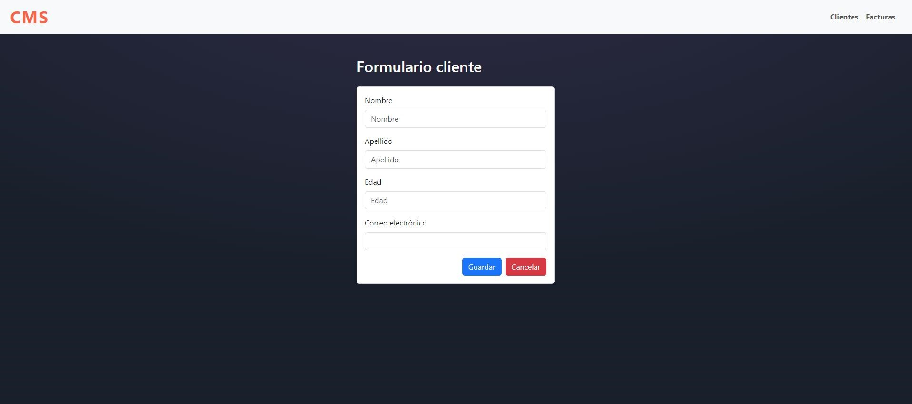

# CmsApp



**Descripción del Proyecto**  
 Alicación simple y reducida de CMS con Angular, permite la creación, edición, visualización y eliminación de clientes y facturas.

## Requisitos

- **Node.js** (versión 18 o superior)
- **npm** (viene instalado con Node.js)
- **Angular CLI** (versión 17)

## Instalación

Para empezar a trabajar con este proyecto en tu máquina local, sigue los siguientes pasos:

1. **Instalar las dependencias:**

   Navega al directorio del proyecto y ejecuta el siguiente comando para instalar todas las dependencias necesarias:

   ```
   cd cms-app
   npm install
   ```

2. **Ejecutar la aplicación:**

   Para iniciar la aplicación en modo de desarrollo, ejecuta el siguiente comando:

   ```
   ng serve
   ```

   Luego abre tu navegador y visita "http://localhost:4200".

## Dependencias

- **Angular CLI**
- **Bootstrap**
- **SweetAlert2**

## Licencia

Este proyecto está bajo la **MIT License**. Consulta el archivo [LICENSE](./LICENSE) para más detalles.
